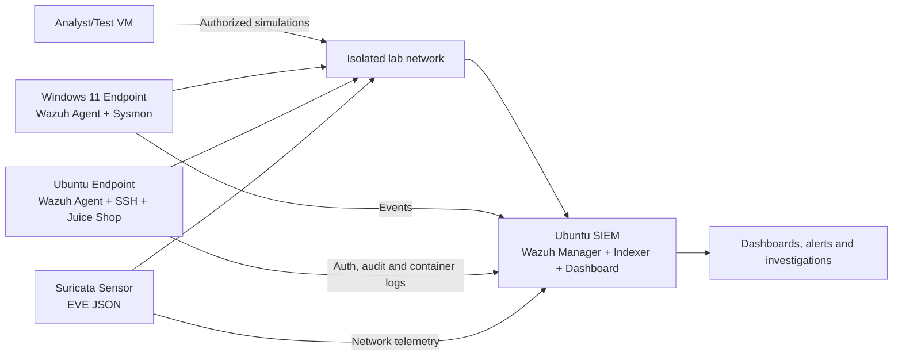

# Mini SOC Lab

**SIEM Monitoring, Detection Engineering and Incident Response**

[GitHub repository: Rohan-bradford/mini-soc-lab](https://github.com/Rohan-bradford/mini-soc-lab)

This repository is a reproducible defensive-security portfolio project built around Wazuh,
Windows Sysmon, Linux audit/authentication logs, Suricata network telemetry, and OWASP Juice
Shop. It demonstrates how a small SOC collects logs, writes detections, triages alerts,
documents incidents, and tracks remediation.

> Use the simulations only inside systems and networks you own or are explicitly authorized
> to test. The included sample telemetry is synthetic and contains no real credentials,
> malware, victims, or public targets.

## Evidence Status

| Artifact | Status |
| --- | --- |
| Architecture and deployment runbooks | Ready |
| Wazuh, Sysmon, Suricata, and endpoint configurations | Ready for lab deployment |
| Detection rules and automated validation | Tested locally |
| Sample logs and alert timelines | Synthetic, sanitized, reproducible |
| Dashboard images | Clearly labelled design mockups |
| Incident reports and playbooks | Completed from synthetic scenarios |
| Live SIEM screenshots and exported saved objects | Pending deployment on the owner's hardware |

The repository does not claim that a live Wazuh cluster or virtual machines were deployed
from this development environment. Docker and a hypervisor were unavailable here. Follow
[docs/live-lab-checklist.md](docs/live-lab-checklist.md) to replace mockups with genuine
captures after deployment.

## Architecture



See [architecture/architecture.md](architecture/architecture.md) for trust boundaries,
data flows, sizing, and network controls.

## Detection Coverage

| Scenario | Data source | Rule | ATT&CK |
| --- | --- | --- | --- |
| Repeated Windows logon failures | Security 4625 | `windows_failed_logons.yml` | T1110 |
| Suspicious PowerShell flags | Sysmon 1 | `windows_suspicious_powershell.yml` | T1059.001 |
| User added to Administrators | Security 4732 | `windows_admin_group_add.yml` | T1098 |
| Harmless test-file hash | Sysmon 11 / FIM | `windows_test_hash.yml` | T1204 |
| Multi-port connection sweep | Suricata flow | `network_port_scan.yml` | T1046 |
| Repeated SSH failures | Linux auth | `linux_ssh_bruteforce.yml` | T1110.001 |
| Web attack indicators | Juice Shop access logs | `web_attack_patterns.yml` | T1190 |
| DNS beacon-like pattern | Suricata DNS | `network_dns_beacon.yml` | T1071.004 |

All rules live under [detection-rules](detection-rules). They are portfolio detections:
review thresholds and field mappings against your deployed schema before production use.

## Repository Map

```text
architecture/              Network design, assets, and data flows
config/                    Sysmon, Wazuh, Suricata, and endpoint collection settings
dashboards/                Dashboard specifications, queries, and labelled mockups
deploy/                    Safe deployment helpers and vulnerable-app Compose file
detection-rules/           Sigma, Wazuh XML, and Suricata rules
docs/                      Build guide, learning roadmap, and live-evidence checklist
hardening/                 Windows, Linux, SIEM, and network baselines
incident-reports/          Four complete investigation reports
playbooks/                 Repeatable SOC response procedures
sample-logs/               Sanitized synthetic Windows, Linux, network, and web logs
scripts/                   Sample generation, validation, and local detection evaluation
simulations/               Safe event-generation procedures
vulnerability-assessments/ Scan plan and remediation evidence template
```

## Quick Validation

Python 3.10 or later is recommended.

```bash
git clone https://github.com/Rohan-bradford/mini-soc-lab.git
cd mini-soc-lab
python -m pip install -r requirements-dev.txt
python scripts/generate_sample_logs.py
python scripts/evaluate_detections.py
python scripts/validate_project.py
pytest
```

Expected result:

```text
8 scenarios generated
8 detections matched
project validation passed
```

## Live Lab Build

1. Create an isolated host-only/internal virtual network.
2. Deploy an Ubuntu SIEM VM with at least 8 GB RAM for a small all-in-one Wazuh lab.
3. Run the Wazuh Docker bootstrap in [deploy/wazuh](deploy/wazuh/README.md), or use the
   official Wazuh all-in-one installation.
4. Create Windows 11 and Ubuntu endpoint VMs.
5. Install Wazuh agents and apply the collection configurations under `config/`.
6. Install Sysmon on Windows and Suricata on the sensor.
7. Start Juice Shop only on the isolated lab network.
8. Import/test detections one at a time.
9. Run the safe simulations and capture real alert evidence.
10. Replace dashboard mockups with screenshots and exports from the live deployment.

Detailed instructions: [docs/build-guide.md](docs/build-guide.md).

## Portfolio Evidence

- [Incident 001: SSH brute force](incident-reports/IR-001-ssh-brute-force.md)
- [Incident 002: Suspicious PowerShell](incident-reports/IR-002-suspicious-powershell.md)
- [Incident 003: Privileged group change](incident-reports/IR-003-admin-group-change.md)
- [Incident 004: Web attack investigation](incident-reports/IR-004-web-attack.md)
- [SOC overview dashboard](dashboards/screenshots/soc-overview.svg)
- [MITRE coverage](dashboards/mitre-coverage.md)
- [Vulnerability remediation example](vulnerability-assessments/sample-remediation-report.md)
- [Learning roadmap](docs/learning-roadmap.md)

## Responsible Use

- Keep vulnerable applications disconnected from public networks.
- Use snapshots and disposable accounts.
- Never use real malware; use known harmless strings and synthetic hashes.
- Do not publish tokens, passwords, VM images, certificates, or raw personal data.
- Set retention limits and sanitize exported logs.
- Treat every live mutation or account change as a controlled test with rollback steps.

## License

MIT
